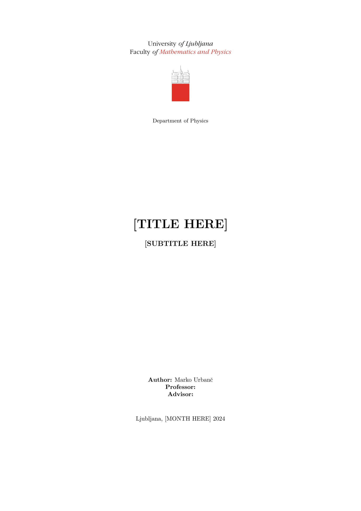
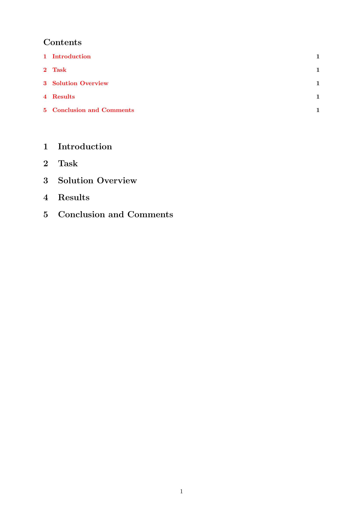

# **FMF Report Latex Template**
This is a Latex template for the FMF report. The template is based on what we received as the mandatory 
template for the subject Seminar I which if I recall correctly was authored by doc. dr. Miha Muškinja.
I've added some macros that I use while writing on topics such as Quantum Mechanics which make math 
writing a bit easier.

## Clone this repo and start writing
This repo is public so you can use it if you like it's vibe and appearance. To clone this repo run the following command in your terminal:
```bash
git clone git@github.com:pengu5055/latex-template.git
```
Notice that for this you do need to have `git` setup and SSH keys added to your GitHub account. If you don't have that configured you can download the repo as a zip file. I recommend using a local installation of Latex such as `TexLive` or `MikTex` to compile the document. Personally I use VS Code with the `LaTeX Workshop` extension to write and compile my documents. However this template is trivial to upload to Overleaf and use it there if you so desire.

### Packages
For novice users of Latex I want to point out that this template lacks some very commonly used packages such as:
- `amsmath`
- `amssymb`
- `siunitx`
- `tikz`
- `physics`
- `bm`
- `xcolor`
- `minted`

I prefer to keep my preamble as clean as possible and add packages as I need them. 

## Appearance


